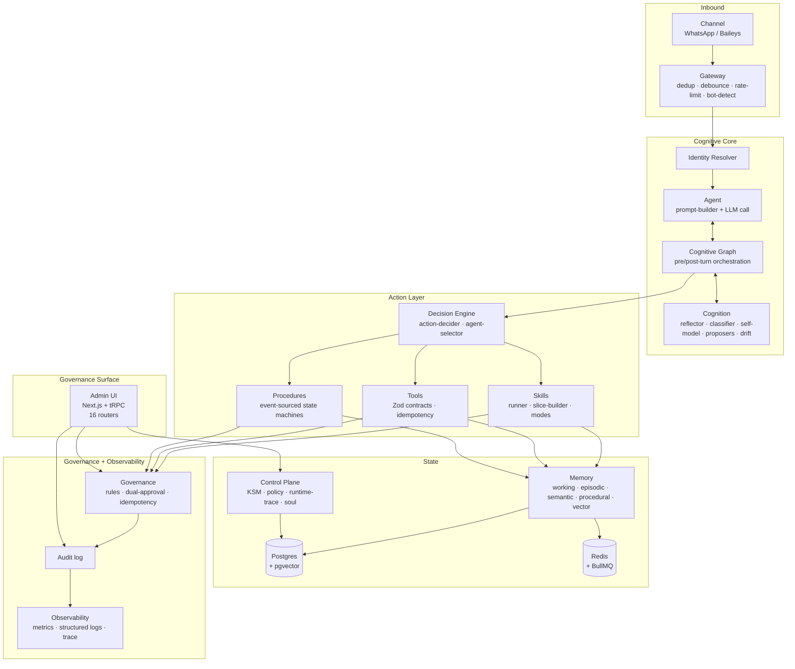

# ARCHITECTURE.md — Maia v3 Mental Model

> Read this after [`AGENTS.md`](AGENTS.md). This document is the mental model of the system — what Maia is, the invariants that hold across all subsystems, and where things live in the code.

## 1. What Maia is

**Maia is a multi-agent platform governed via WhatsApp.** Three core concepts:

- **Tenant** — an isolated context. Today the platform runs single-tenant under the reserved `tenant_id='primary'` (the legacy `'default'` bucket was eliminated in #323 and is now rejected fail-closed); the schema and tenant-guard middleware support multiple. Adding a tenant must not risk leaking data into another.
- **Agent** — a named, versioned operational identity owned by a tenant. An agent has its own system prompt, learned skills, learned procedures, and memory. A tenant can own multiple agents.
- **Channel** — how messages reach an agent. WhatsApp is the only enabled channel today; the schema (`channels`, `channel_policies`, `roles`) is multi-channel by design. A `channel_policy` decides which agent answers which channel.

**The platform's promise:** *agents learn from experience, but only evolve inside governance, scope, and evidence.* Every behavior change is owner-approved, scoped to `tenant_id + agent_id`, and backed by audited evidence.

The codebase is **single-tenant in runtime, multi-tenant + multi-agent in schema.** The runtime gates are listed in [`README.md` § Estado atual](README.md#estado-atual--gaps-conhecidos).

## 2. Pillars

The 9 pillars (canonical in `README.md`, deep-dives linked here):

| # | Pillar | Where to read more |
|---|---|---|
| 1 | Agents that learn (capability + skill proposers, dialogical acquisition) | [`concerns/cognitive-stack.md`](docs/architecture/concerns/cognitive-stack.md) |
| 2 | Versioned governance (operational identity in 4 layers) | [`concerns/governance-observability.md`](docs/architecture/concerns/governance-observability.md) |
| 3 | Isolation as objective (`tenant_id + agent_id` everywhere stateful) | [`concerns/tenant-isolation.md`](docs/architecture/concerns/tenant-isolation.md) |
| 4 | Cognitive graph (lightweight orchestration as a graph) | [`concerns/cognitive-stack.md`](docs/architecture/concerns/cognitive-stack.md) |
| 5 | Self-model + typed reflection (confidence is deterministic) | [`concerns/cognitive-stack.md`](docs/architecture/concerns/cognitive-stack.md) |
| 6 | Skills + Procedures executable (versioned, event-sourced) | [`concerns/action-layer.md`](docs/architecture/concerns/action-layer.md) |
| 7 | Scoped memory (6 controls per entry) | [`concerns/tenant-isolation.md`](docs/architecture/concerns/tenant-isolation.md) |
| 8 | WhatsApp as one channel (multi-channel by design) | [`concerns/channel-policy.md`](docs/architecture/concerns/channel-policy.md) |
| 9 | First vertical: PF + PJ finance | A concrete proof; handled at the `src/tools/`, `src/import/`, `src/lib/` level — not a constraint on the platform. |

For the **current status of each pillar** (✅ in production / 🚧 partial / 🔴 known gap / ⏳ roadmap), see `README.md` "Os 9 pilares" — that table is where status stays current.

## 3. Inviolable invariants

Six rules that are **never** bent. A violation is a blocking production bug, not technical debt.

1. **Tenant isolation.** No code path may read, write, or recall data for tenant A while serving a request for tenant B. Every query, cache key, Redis key, and ALS context propagates `tenant_id + agent_id`. → [`concerns/tenant-isolation.md`](docs/architecture/concerns/tenant-isolation.md)
2. **LLM proposes, backend disposes.** The LLM emits typed intents (Zod). The backend validates against state and rules. The backend, not the LLM, decides whether an action happens. → [`concerns/action-layer.md`](docs/architecture/concerns/action-layer.md)
3. **Confidence is computed (self-model) / gated (routing).** *Self-model and governance* confidence comes from deterministic formulas over evidence counts — the LLM never declares it; this is the inviolable part. *Decision-engine routing* confidence (intent, pending-gate, procedure-selector) MAY be LLM-proposed, but a backend threshold always decides — "LLM proposes, backend decides" (invariant 2). Canonical statement and the two-kinds distinction: [`docs/ai/maia-invariants-checklist.md` § Deterministic Confidence](docs/ai/maia-invariants-checklist.md#deterministic-confidence). → [`concerns/cognitive-stack.md`](docs/architecture/concerns/cognitive-stack.md)
4. **Audit every decision.** Side-effect or governance decision → row in `audit_logs` with action label, tenant context, and the data the rule was applied to. → [`concerns/governance-observability.md`](docs/architecture/concerns/governance-observability.md)
5. **Fail-closed.** Missing tenant context, unmatched policy, unresolved channel → reject. No silent fallback to `'default'` in dynamic paths.
6. **Identity is governed.** Agents *propose* changes to their own operational profile; owners *approve*. The agent never edits its own profile directly. → [`concerns/cognitive-stack.md`](docs/architecture/concerns/cognitive-stack.md)

These six are the **stop conditions** for any change. If your PR makes any of them harder to satisfy, the PR is wrong.

## 4. Layered model

## 5. Code map

Every `src/` subdirectory has a one-line role here and a deep-dive module doc.

| Path | Role | Module doc |
|---|---|---|
| `src/admin-ui/` | Next.js 14 + tRPC + NextAuth governance console (16 routers) | [admin-ui.md](docs/architecture/modules/admin-ui.md) |
| `src/agent/` | Prompt builder + ReAct loop entry | [agent.md](docs/architecture/modules/agent.md) |
| `src/cognition/` | Reflector, classifier, self-model, capability/skill proposers, drift detector, gap-escalation, procedure/role selectors, step-evaluator | [cognition.md](docs/architecture/modules/cognition.md) |
| `src/cognitive-graph/` | Orchestrator, pre/post-turn graphs, node registry, latency budget | [cognitive-graph.md](docs/architecture/modules/cognitive-graph.md) |
| `src/config/` | Zod-validated env vars + feature flags | [config.md](docs/architecture/modules/config.md) |
| `src/control-plane/` | Knowledge state machine, policy engine, runtime-trace, skill-registry, soul layer | [control-plane.md](docs/architecture/modules/control-plane.md) |
| `src/db/` | Drizzle schema + repositories | [db.md](docs/architecture/modules/db.md) |
| `src/gateway/` | Baileys (WhatsApp in/out), rate-limit, dedup, debouncer, bot-detection | [gateway.md](docs/architecture/modules/gateway.md) |
| `src/governance/` | Rules, audit, dual-approval, idempotency | [governance.md](docs/architecture/modules/governance.md) |
| `src/identity/` | Resolver, quarantine, voice modifier, proposal generator, profile renderer | [identity.md](docs/architecture/modules/identity.md) |
| `src/import/` | OFX / CSV importers, reconciliation flow | [import.md](docs/architecture/modules/import.md) |
| `src/lib/` | Wrappers: Anthropic, Whisper, Redis, alerts, holidays, decimal | [lib.md](docs/architecture/modules/lib.md) |
| `src/memory/` | 5 layers (working / episodic / semantic / procedural / vector) over Postgres + Redis | [memory.md](docs/architecture/modules/memory.md) |
| `src/objectives/` | Work loop: registry de kinds (perceptores/executores) de objetivos | [objectives.md](docs/architecture/modules/objectives.md) |
| `src/ops/` | Verifiable backup (lifecycle, signed manifest, envelope encryption, RPO/RTO) + data lifecycle (retention matrix, legal hold, tombstones) | [ops.md](docs/architecture/modules/ops.md) |
| `src/procedures/` | Engine, test runner, event-sourced execution | [procedures.md](docs/architecture/modules/procedures.md) |
| `src/runtime/` | Decision engine, action-decider, agent-selector, channel-resolver, builders, context | [runtime.md](docs/architecture/modules/runtime.md) |
| `src/scheduling/` | Series → occurrences → tasks → outbox, recurring workflows | [scheduling.md](docs/architecture/modules/scheduling.md) |
| `src/setup/` | Bootstrap wizard (owner, entities, permissions) | [setup.md](docs/architecture/modules/setup.md) |
| `src/shared/` | Cross-module types and utilities | [shared.md](docs/architecture/modules/shared.md) |
| `src/skills/` | Runner, slice-builder, modes (prompt_only / evaluator / tool_mediated), cache | [skills.md](docs/architecture/modules/skills.md) |
| `src/tools/` | Tool registry, Zod contracts, idempotency keys | [tools.md](docs/architecture/modules/tools.md) |
| `src/types/` | Global types | [types.md](docs/architecture/modules/types.md) |
| `src/user-layer/` | Interlocutor modeling | [user-layer.md](docs/architecture/modules/user-layer.md) |
| `src/workers/` | 33 workers — cron + event-driven (reflection batch, KSM promoter, outbox drain, drift detector, etc.) | [workers.md](docs/architecture/modules/workers.md) |
| `src/workflows/` | Pending questions, dual-approval state machines | [workflows.md](docs/architecture/modules/workflows.md) |

## 6. Cross-cutting concerns

| Concern | Why it cuts across | Doc |
|---|---|---|
| **Tenant isolation** | Touches every stateful boundary: DB, Redis, ALS context, cache keys, dedup, debounce, rate-limit, idempotency, embeddings | [tenant-isolation.md](docs/architecture/concerns/tenant-isolation.md) |
| **Cognitive stack** | How an agent thinks, reflects, learns; spans `cognition` + `cognitive-graph` + `control-plane` | [cognitive-stack.md](docs/architecture/concerns/cognitive-stack.md) |
| **Action layer** | How decisions become side-effects; spans `skills` + `tools` + `procedures` + `runtime/decision-engine` | [action-layer.md](docs/architecture/concerns/action-layer.md) |
| **Channel / Role / Policy** | How messages enter and reach the right agent; spans `gateway` + `channel_policies` + `roles` | [channel-policy.md](docs/architecture/concerns/channel-policy.md) |
| **Governance + Observability** | Rules, audit, metrics, trace, drift; spans `governance` + `control-plane` + `admin-ui` | [governance-observability.md](docs/architecture/concerns/governance-observability.md) |
| **Capability taxonomy** | How baseline, channel behavior, role, skill, tool, pack/grant, and policy compose into the effective behavior + visible/executable tools for a turn; spans `roles` + `skills` + `tools` + `governance` + `runtime/decision` | [capability-taxonomy.md](docs/architecture/concerns/capability-taxonomy.md) |

**Rule of thumb when concerns overlap:** the doc that describes how something is **produced** lives in one concern (e.g., drift detection is computed in `cognitive-stack`). The doc that describes how it is **gated, approved, or audited** lives in `governance-observability`. Drift alerts that surface in admin-ui are governance; the detector that emits them is cognitive.

## 7. Glossary

| Term | Meaning |
|---|---|
| **Tenant** | Isolated context owning agents and data |
| **Agent** | Named, versioned operational identity within a tenant |
| **Channel** | Surface that delivers messages (WhatsApp today; multi-channel by design) |
| **Role** | Operational mode an agent can adopt for a given conversation (e.g., financial, support) |
| **Policy** | Owner-defined rule that decides which agent/role answers what input |
| **Skill** | Versioned, learned capability — composition of tools and/or procedures with success criteria |
| **Tool** | Zod-typed function with idempotency contract; LLM-callable |
| **Procedure** | Event-sourced multi-step state machine with typed success criteria |
| **Capability** | A unit of "thing the agent can do" — proposed by Maia (dialogical acquisition), approved by owner |
| **Cognitive graph** | Lightweight DAG orchestrating pre-turn and post-turn modules with `runWhen` / `timeout` / `fallback` per node |
| **Knowledge state** | 9-state lifecycle (KSM) for learned facts / rules / procedures / hints |
| **Self-model** | Agent's internal model of its own domain / skill / gap with deterministic confidence |
| **Drift** | Detected deviation between operational profile and observed behavior (7 types × 4 severities) |
| **Dialogical acquisition** | Process of acquiring new capabilities through 4-level escalation: silent → dashboard → mentionable → proposed |
| **Operational identity** | 4-layer governed identity: immutable core / learned profile / episodic memory / approved backlog |
| **ALS context** | AsyncLocalStorage carrying `tenant_id + agent_id` for the duration of a request |
| **Outbox** | Transactional outbound queue — protects against double-send |
| **KSM** | Knowledge State Machine (P10a) — `learned_rules` lifecycle |
| **Soul layer** | Append-only behavioral biases per agent (P8b) |
| **`'primary'`** | Reserved `tenant_id`/`agent_id` for the single-tenant runtime home (issue #323). The legacy `'default'` literal was eliminated — it carries no data and is rejected fail-closed (`MAIA_REJECT_DEFAULT_LITERAL` default-ON). `'system'` remains the sanctioned bucket for genuinely-global maintenance. |

## 8. Where to look for current status

| Question | Where |
|---|---|
| Which pillars are ✅ / 🚧 / 🔴? | [`README.md` § Os 9 pilares](README.md#os-9-pilares) |
| What runtime gaps exist? | [`README.md` § Estado atual & gaps conhecidos](README.md#estado-atual--gaps-conhecidos) |
| What merged recently? | `git log --oneline origin/main -30` |
| What's in flight? | `gh pr list --state open` and each doc's "In-flight changes" section |
| What's broken / partial? | GitHub issues; each concern's "Known gaps" subsection (re-verified at write time) |

**Important:** do not inherit gap claims from this document, the README, or any other doc without re-verifying against current issues + PRs. Stale gap lists are how documentation lies. Code is the source of truth; this doc is the map to find your way into the code.

## 9. Out-of-scope here

This document is the mental model. It does not contain:

- **Operational procedures** — see [`docs/runbooks/`](docs/runbooks/) (how to debug X, how to roll back Y)
- **Per-feature design specs** — see [`docs/superpowers/specs/`](docs/superpowers/specs/)
- **Implementation plans** — see [`docs/superpowers/plans/`](docs/superpowers/plans/)
- **End-user documentation** — not in this repo

---

| | |
|---|---|
| Last verified | 2026-05-28 |
| Against `main` HEAD | `c49c3855` |
| Re-verify when | This stamp is older than 30 days, or any of the following change: subdirectory layout under `src/`, schema in `migrations/`, runtime feature flags, the README's pillar table. |
