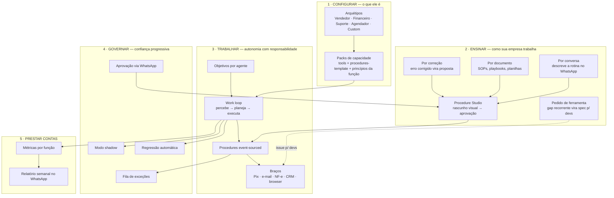

# Maia — Plataforma de Funcionários Digitais Aprendíveis — Visão & Blueprint

**Date:** 2026-06-10
**Status:** Approved — visão de produto aprovada pelo owner (sessão de redesign da UI, pós-PR #460)
**Master refs:** `ARCHITECTURE.md` (pilares 1, 2, 6; invariantes 1–6), `docs/architecture/concerns/capability-taxonomy.md`, `docs/architecture/concerns/cognitive-stack.md`
**Architecture Locks:** todos os 6 invariantes do `ARCHITECTURE.md` são stop conditions deste blueprint — nada aqui os afrouxa.

---

## 0. Tese

> **Maia é uma plataforma de funcionários digitais: o operador escolhe o que o agente É (arquétipo), ensina como a SUA empresa trabalha (ensino dialógico), o agente trabalha sozinho atrás de metas (work loop) usando ferramentas da função (packs), sob governança auditada (aprovação onde o dono está) e provando valor em números (prestação de contas).**

A vertical financeira (pilar 9) é o **primeiro professor** da plataforma, não o emprego dela. O `ARCHITECTURE.md` já declara a vertical como "prova concreta, não restrição" — este documento torna essa separação um roteiro executável.

### Escada de autonomia

| Nível | Capacidade | Estado |
|---|---|---|
| 0 | **Responde bem** — turno a turno, reativo, aprende sob aprovação | ✅ hoje |
| 1 | **Executa tarefas** — começa e termina trabalho sob demanda | 🚧 parcial (procedures) |
| 2 | **Possui processos** — percebe que há trabalho e faz sem ser pedido | 🔨 work loop |
| 3 | **Possui uma função** — metas, prestação de contas, escala exceções | 🔨 alvo do blueprint |

---

## 1. O desenho

---

## 2. Blocos: fundação existente × a construir

### 2.1 Arquétipos & Packs — *"vendedor não vê OFX"*

Princípio de menor privilégio aplicado a agentes: o agente nasce com o **mínimo da função** e aprende o resto sob aprovação. Cada tool a mais é superfície de risco (`tool_blast_radius`).

- ✅ Existe: taxonomia roles·skills·tools·packs·policies; escopo por role (#453); capacidade-base (#452); tool registry com classes de risco.
- 🔨 Construir:
  - **Packs curados** por função (tools + procedures-template + princípios sugeridos). Primeira entrega: presets de perfil no wizard (frontend, `app/agents/_components/archetypes.ts`); segunda: vínculo pack→tools no backend (grants).
  - **Baseline neutra**: auditar o que todo agente herda da vertical financeira (`src/identity/maia-prompt.md` é seed do agente financeiro, NÃO a identidade da plataforma) e mover o que for financeiro para o pack Financeiro.

### 2.2 Ensino — o coração do produto

- ✅ Existe: aquisição dialógica (4 níveis), capability/skill proposers, KSM (9 estados), procedures event-sourced, memória semântica + embeddings, fluxo proposta→aprovação.
- 🔨 Construir:
  - **Ensino por conversa**: a Maia entrevista o dono sobre a rotina → rascunho de procedure tipada → aprovação.
  - **Ensino por documento**: ingestão de SOP/playbook → rascunhos de procedures + knowledge entries.
  - **Ensino por correção**: correção do dono vira proposta de ajuste (reflector→proposer).
  - **Pedido de ferramenta**: gap recorrente detectado pelo agente vira proposta estruturada (o que queria fazer, situações com links para traces, frequência, rascunho do contrato Zod) → triagem do owner → issue para devs. Agregação por similaridade (N pedidos parecidos = 1 pedido com contador). **Guardrail: o agente especifica; humano implementa e instala.** Tool nova segue o caminho normal (código revisado, contrato Zod, classe de risco, aprovação).
  - **Procedure Studio** no console: visualizar o fluxo desenhado antes de aprovar.

### 2.3 Work loop & Braços — de reativo para proativo

- ✅ Existe: scheduling (séries→ocorrências→tasks→outbox), 33 workers, decision engine, tools Zod com idempotência, test runner de procedures.
- 🔨 Construir:
  - Entidade **Objetivo** por agente (`tenant_id + agent_id`, meta declarativa, métricas-alvo) + orquestrador: varre estado → gera tarefas → agente executa via procedures.
  - Conectores: Pix/cobrança bancária, e-mail, NF-e; depois CRM e browser-use.
  - Sandbox de execução para tools de efeito colateral (pré-requisito do playground — ver spec `2026-06-10-agent-playground-design.md`).

### 2.4 Governança de confiança progressiva

- ✅ Existe: dual-approval atômico, matriz de 14 classes, travas de arquitetura, audit total, drift detectors, pending questions.
- 🔨 Construir:
  - **Modo shadow**: versão proposta roda em paralelo sem responder; comparação lado a lado como evidência de aprovação.
  - **Regressão automática**: proposta de skill testada contra conversas históricas; resultado anexado à proposta.
  - **Aprovação via WhatsApp**: somente risco baixo/médio; dual-approval e travas de arquitetura permanecem exclusivos do console.
  - **Rollback real** (hoje `NOT_IMPLEMENTED` em todas as SoTs): começar por `agent_operational_profile_versions`.
  - **Fila de exceções**: resposta humana destrava a procedure automaticamente.

### 2.5 Prestação de contas

- ✅ Existe: traces, audit log, custo por modelo (llmSettings).
- 🔨 Construir: agregação por função/objetivo (taxa de resolução autônoma, tempo de ciclo, R$ movimentado, custo LLM por tarefa); relatório semanal proativo no WhatsApp; painel ROI no console.

### 2.6 Transversal — plataforma vendável

🔨 Multi-tenant runtime (gates mapeados no README), templates de função extraídos de clientes reais, onboarding self-service.

---

## 3. Superfícies novas do console

| Tela | O quê | Status |
|---|---|---|
| Wizard passo "Função" | arquétipo com preview do preset | 🔨 nesta iteração |
| Aba "Atividade" no agente | traces, drift, skills, canais do agente (#462) | 🔨 nesta iteração |
| Diff antes de aprovar | perfil ativo vs. proposto lado a lado (#461) | 🔨 nesta iteração |
| `/audit` | trilha de auditoria visível (#463) | 🔨 nesta iteração |
| Checklist de ativação | dashboard guia tenant→agente→perfil→canal (#465) | 🔨 nesta iteração |
| Console responsivo | aprovar do celular (#466) | 🔨 nesta iteração |
| Playground "Testar" | chat sandbox com versão proposta (#464) | spec própria |
| Procedure Studio | fluxo visual de procedures ensinadas | fase 3 |
| Aba "Objetivos" | metas + tarefas do work loop | fase 2 |
| Painel ROI | custo vs. resultado por função | fase 2/3 |
| Fila de exceções | trabalho travado esperando humano | fase 2 |

## 4. Roadmap

1. **Fundação da confiança** (semanas): rollback real, #461, #463, sonda sintética ponta-a-ponta, e2e no CI.
2. **Primeiro funcionário** (1–2 meses): work loop mínimo + conectores de cobrança + fila de exceções + relatório semanal. Critério de saída: **um trabalho inteiro provado com cliente real, medido em R$**.
3. **Generalização** (2–3 meses): packs de arquétipo no backend, ensino por conversa + Procedure Studio, pedido de ferramenta, segundo arquétipo em domínio não-financeiro.
4. **Plataforma** (contínuo): multi-tenant runtime, templates de função, aprovação via WhatsApp, browser-use, painel ROI.

## 5. Anti-escopo

- Autonomia genérica sem função definida.
- Editor de prompt livre pelo cliente (quebra a governança de identidade — invariante 6).
- Tools sem contrato Zod/idempotência.
- Agente alterando a própria identidade/ferramentas sem aprovação humana.
- Agente escrevendo e instalando o próprio código de tool (horizonte distante; exigiria spec de segurança própria).

## 6. Issues derivadas

| Issue | Bloco | Fase |
|---|---|---|
| #461 diff antes de aprovar | Governança | 1 — nesta iteração |
| #462 aba Atividade | Console/Arquétipos | 1 — nesta iteração |
| #463 página /audit | Governança | 1 — nesta iteração |
| #464 playground | Governança/Sandbox | spec nesta iteração; implementação fase 2 |
| #465 checklist de ativação | Console | 1 — nesta iteração |
| #466 console responsivo | Console | 1 — nesta iteração |
| (a abrir) packs de arquétipo no backend | Arquétipos | 3 |
| (a abrir) entidade Objetivo + work loop | Work loop | 2 |
| (a abrir) pedido de ferramenta | Ensino | 3 |
| (a abrir) rollback real de profile versions | Governança | 1 |
