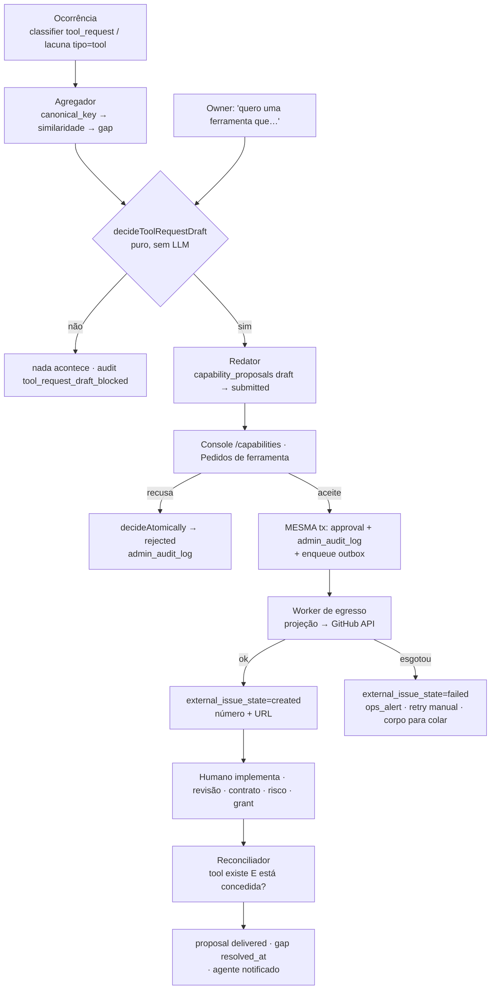

# Pedido de Ferramenta — gap recorrente vira spec para os devs — Design Spec

**Date:** 2026-07-31
**Status:** Draft v1 — escrita pelo agente Architect a partir da direção do owner (issue #471). Não implementa nada; especifica.
**Scope:** Fechar a **v2 da #471** — o que a v1 (#476) deixou de fora. Transformar "pedido de ferramenta" de uma view read-only do console num artefato governado: o agente **redige** uma proposta interna quando um critério determinístico é satisfeito, o **owner decide**, o **backend** cria a issue no GitHub ao aceite, e o gap **fecha** quando a tool passa a existir. O agente nunca abre issue, nunca implementa, nunca instala, nunca concede.

**Referências (verificadas no HEAD `7b34e7e0`):**

- `src/cognition/gap-escalation/engine.ts` — `decideEscalation(input): EscalationDecision`. Puro, síncrono, zero I/O, **invariante grepável: não importa SDK de LLM**. Cadeia `silent → dashboard → mentionable → proposed`; `proposed` é terminal para o engine.
- `src/cognition/gap-escalation/types.ts` — `DEFAULT_RULES`: `dashboard_freq_threshold: 3`, `mentionable_severity_threshold: 5`, `proposed_combined_threshold: 8`, `proposed_min_distinct_contexts: 2`, `cooldown_days_proposed_to_proposed: 14`.
- `src/db/repositories/capability-repos.ts` — `capabilityGapsRepo.upsert` casa por **igualdade exata** de `capability_description` e incrementa `frequency_score`; o comentário na própria linha do match registra o débito: *"Simple match by description (LIKE or exact); P3+ pode usar embedding similarity"*. `capabilityProposalsRepo.transition` com o mapa de transições `draft→submitted→{approved,rejected}`, `approved→testing`, `testing→{delivered,reverted}`, `delivered→reverted`.
- `src/workers/gap-escalation-monitor.ts` — `distinct_contexts_count` é um **proxy hardcoded** (`gap.contexto && gap.contexto.length > 0 ? 2 : 1`), com TODO declarado.
- `src/agent/notification-adapter.ts` — `notifyOwnerForGap`: o canal depende **exclusivamente** do `GapLevel`, e **`silent` JAMAIS notifica o owner** — critério de aceitação nº 1 do P5, defendido por gate de `grep` no próprio arquivo. Restrição dura desta spec (§3.3, §8.11).
- `src/db/schema.ts` — `agent_capability_gaps` (`~:1369`): `capability_description`, `tipo CHECK IN ('tool','knowledge','procedure','technical')`, `contexto`, `frequency_score DEFAULT 1`, `severity_score DEFAULT 1`, `current_level CHECK IN ('silent','dashboard','mentionable','proposed')`, `source_candidate_id`, `last_observed`. **Sem coluna de encerramento, sem embedding, sem UNIQUE.** `capability_proposals` (`~:1819`): `gap_id`, `capability_type`, `proposed_spec jsonb`, `status`, `decided_by`, `decision_reason`, `delivered_at`, `delivery_artifact_ref`.
- `src/cognition/classifier.ts` (`:23`) — variante `tool_request`: `{ type, tool_name_sketch, description, inputs_sketch, outputs_sketch }`. `src/cognition/persister.ts` (`:236`) roteia `tool_request` **só** para `cognitive_candidates` — **nada consome essa fila hoje**.
- `src/cognition/proposal-approval-handler.ts` — `dispatchApproval` retorna `approved_no_op` para `capability_type='tool'` (só `holiday` tem handler real).
- `src/admin-ui/app/capabilities/_components/tool-requests.tsx` — a v1 inteira: filtra `listGaps` por `tipo==='tool'` no cliente e monta uma URL `issues/new?title=…&body=…` (`GITHUB_NEW_ISSUE_URL`, `:32`). **Read-only: nenhuma mutation, nenhum estado persistido, nenhum aceite.**
- `src/admin-ui/trpc/routers/capabilities.ts` — `listGaps` é `protectedProcedure.query`; o router é read-only ponta a ponta.
- `src/db/repositories/admin-repos.ts` — `proposalsUnifiedRepo.decideAtomically`: aprovação + `admin_audit_log` + transição do source na **mesma** `withTx`. `adminAuditLogRepo.append` (`~:1184`); `admin_audit_log.action` é `text` livre (sem enum).
- `src/admin-ui/lib/proposal-type-registry.ts` + `src/admin-ui/lib/approval-matrix.ts` — `ProposalTypeId` já inclui `'capability_proposal'` com `defaultApprovalClass: 'capability_safe_tool'`; classes irmãs `capability_dangerous_tool` e `capability_side_effect` já existem.
- `src/observability/labels.ts` — `sanitizeLabels(metric, labels)`: allowlist de chaves, **deny list vence a allow list**, `PII_VALUE_PATTERNS` (JID Baileys, e-mail, corrida de dígitos telefônica, dígito puro longo, URL) → `__sanitized__`, orçamento de cardinalidade → `__overflow__`, e `MAIA_STRICT_METRIC_LABELS` promove violação a `throw` na suíte.
- `src/control-plane/runtime-trace/lib/redaction.ts` — **allowlist estrutural em TODOS os níveis** (`STRUCTURAL_TOP_LEVEL`, `DECISION_SCALARS_TOP`, `POLICY_HOOK_ALLOWED`, `DECISION_META_ALLOWED`, `DECISION_PACKET_ALLOWED`); tudo fora é dropado com contador `_redaction_dropped_unknown_count`. `reason_code` sim, `reason` livre não.
- `src/observability/turn-trace.ts` (`~:182`, `~:194`) — *"The PEP verdict, an enum — not the operator's free-text reason"* e *"there is NO message text, no media ref, no phone, no push name"*.
- `src/tools/schema-json.ts` (#509) — `buildToolSchema`, `schemaHash`, `FORBIDDEN_FIELD_NAMES` (`tenant_id`, `agent_id`, `approved`, `dual_approval_granted`, `api_key`, …), `MAX_TOOL_SCHEMA_BYTES = 16_384`, `additionalProperties:false` sempre, fail-closed via `ToolSchemaConversionError`.
- `src/tools/_registry.ts` — `Tool<I,O>` (`name`, `input_schema`, `output_schema`, `required_actions`, `side_effect`, `operation_type`, `audit_action`, `handler`, …) e `REGISTRY`, um objeto **estático** compilado no build. `getAgentToolSchemas(visibleToolNames, byEntity)`.
- `src/memory/vector.ts` — `recall({query, escopo, tipos?, k?})`: `1 - (embedding <=> $vec::vector) AS score`, **sempre** filtrado por `tenant_id` + `agent_id` antes do ORDER BY vetorial. `agent_memories.embedding VECTOR(1024)`, índice `ivfflat vector_cosine_ops`. `src/lib/embeddings.ts` — `getEmbeddingProvider(): EmbeddingProvider` com `DimensionGuard`.
- `src/governance/idempotency-effects.ts` + `src/workers/idempotency-outbox-relayer.ts` — o outbox transacional canônico: enqueue na mesma tx, UNIQUE `(tenant_id, agent_id, idempotency_key)`, `status/attempts/max_attempts/next_attempt_at/last_error/provider_ref`, backoff exponencial, `FOR UPDATE SKIP LOCKED`, advisory lock global, terminal `failed` com `ops_alert`, e `deriveProviderDedupKey` fechando a janela de crash-após-envio.
- `docs/architecture/concerns/capability-taxonomy.md` §4 — qualquer tool `side_effect: 'write' | 'communication'` **nunca** pode ser baseline; §7 — "tool registrada fora de `_registry.ts`" e "tool exposta só por fiação, sem grant real" são anti-padrões nomeados.
- `docs/superpowers/specs/2026-06-10-learnable-workforce-vision.md` §2.2 — o guardrail de origem: *"o agente especifica; humano implementa e instala"*; §6 registra "#471 … v1 entregue (#476); **v2 = aceite via API + fechamento do gap**".
- `docs/superpowers/specs/2026-06-10-mcp-external-tools-design.md` — MCP é a resposta barata para parte da #471: o agente pode **pedir**, nunca registra nem aprova servidor.

**Architecture Locks tocados:** nenhum afrouxado. O `tool_blast_radius` é **reforçado**: o pedido não cria, não expõe e não concede nenhuma tool. Os 6 invariantes do `ARCHITECTURE.md` são stop conditions — em particular #2 (LLM propõe, backend decide), #3 (confiança computada: o limiar é aritmética sobre linhas do banco, nunca julgamento de LLM), #4 (auditar toda decisão) e #5 (fail-closed).

**Depends on:** #509 (`schema-json.ts`, de onde vem a régua do contrato) · #514 (allowlist estrutural + sanitização de valores, o padrão de privacidade reusado) · #492/#494 (motor unificado de propostas + `decideAtomically`) · #503 (`agent_turns`, migração 097 — a identidade de turno que o limiar exige).
**Blocks:** aposentadoria da URL pré-preenchida de `tool-requests.tsx` · backlog de conectores dirigido por demanda medida em vez de achismo.

---

## §0. Purpose & problema

A #471 v1 (#476) entregou **uma tela**. O que existe hoje, verificado no HEAD:

1. `agent_capability_gaps` acumula lacunas `tipo='tool'` com um contador escalar.
2. `tool-requests.tsx` lista essas linhas e monta um link `issues/new?title=…&body=…`. O humano clica, o formulário do GitHub abre pré-preenchido, ele submete.
3. Fim. Nenhuma mutation, nenhum estado de aceite, nenhuma issue rastreada, nenhum fechamento. Reabrir a tela mostra o mesmo gap para sempre.

E há três defeitos estruturais que impedem o caminho "natural" de sequer disparar:

- **`severity_score` nunca é escrito.** Nenhum caminho de código o incrementa; fica em `1`. A transição `dashboard → mentionable` exige `>= 5`. **Logo nenhum gap chega a `proposed` pelo caminho natural** — e o `capability-proposer`, que só dispara em `proposed`, nunca roda para uma lacuna real.
- **Dedup por igualdade exata.** "preciso consultar o estoque" e "consultar estoque no ERP" viram dois gaps de `frequency_score=1` cada. O contador que deveria medir recorrência mede coincidência de digitação.
- **`distinct_contexts_count` é um proxy hardcoded** (`contexto ? 2 : 1`), não uma contagem.

Some-se: `dispatchApproval` devolve `approved_no_op` para `capability_type='tool'`, `approved → testing → delivered` não tem caller em produção, e nada fecha o gap de origem. O ciclo não tem fim — o gap fica em `proposed` para sempre e ainda ancora o cooldown de 14 dias do tenant inteiro via `daysSinceLastProposed()`.

**O problema desta spec** não é "listar gaps": é definir, como mecanismo verificável, (a) quando três coisas são *a mesma coisa*, (b) quem tem o direito de criar a issue e o que acontece quando isso falha, (c) como um artefato nascido de traces de cliente atravessa a fronteira do tenant sem levar conteúdo junto, e (d) como o ciclo fecha.

---

## §1. Escopo e não-escopo

### Em escopo

| # | Entrega |
|---|---|
| 1 | Evidência por ocorrência (não só contador) com identidade de turno e janela temporal. |
| 2 | Critério determinístico de **equivalência** entre ocorrências, com embeddings, e tratamento explícito de quase-duplicatas. |
| 3 | Gate determinístico do rascunho: 3 ocorrências equivalentes em ≥2 turnos distintos em 30 dias, **ou** pedido explícito do owner. |
| 4 | Rascunho de pedido: problema, frequência, impacto, referências tenant-safe, risco estimado, contrato Zod preliminar. |
| 5 | Triagem do owner no console reusando o motor unificado de propostas (`decideAtomically`). |
| 6 | Criação da issue **pelo backend**, ao aceite, com exatamente-uma-vez e caminho de falha explícito. |
| 7 | Projeção de egresso: allowlist estrutural + sanitização de valores + pseudonimização de tenant/agent. |
| 8 | Reconciliação e fechamento: tool registrada ⇒ proposta `delivered`, gap resolvido, agente notificado. |
| 9 | Auditoria de criação, agregação, aceite, recusa, falha e fechamento. |

### Fora de escopo (explícito)

- **Escrever ou instalar a tool.** O pedido produz um documento. `REGISTRY` é objeto estático em TS; não existe — e esta spec não cria — caminho de registro em runtime.
- **Conceder a tool ao agente.** Grants são console (#408) e o dispatcher revalida.
- **Corrigir o `severity_score` morto / retunar `gap_escalation_rules`.** Defeito real, registrado em §13; a escada `silent→…→proposed` governa *visibilidade* e continua intacta aqui.
- **Consumir a fila `cognitive_candidates` de `tool_request`.** Ela vira a fonte de ocorrências em §2.3, mas a variante do classificador não é redesenhada.
- **Notificar o owner por WhatsApp.** `communication` exige aprovação própria; §13.
- **Pedido de ferramenta que é, na verdade, um servidor MCP.** A `2026-06-10-mcp-external-tools-design.md` já cobre "o agente pede, nunca registra". A triagem pode rotear um pedido para o caminho MCP; o roteamento é do owner, não automático.
- **Multi-repo.** Um repositório alvo, configurado. Multi-repo é §13.

---

## §2. Modelo de dados — o que reusa, o que é novo

Regra de ouro seguida aqui: **nada de tabela nova onde uma coluna aditiva resolve**, e nada de motor novo onde um existente serve.

### §2.1 Reusado sem alteração

| Artefato | Papel no pedido de ferramenta |
|---|---|
| `agent_capability_gaps` | Continua sendo a **unidade de agregação** (o "pedido"). Um pedido *é* um gap `tipo='tool'`. |
| `capability_proposals` | Continua sendo a **unidade de proposta** (o "rascunho"). Um rascunho *é* uma linha `capability_type='tool'`, `gap_id` apontando para o gap. Máquina de estados e `transition()` intactas. |
| `proposalsUnifiedRepo.decideAtomically` | O aceite/recusa. Nenhum motor de aprovação novo. |
| `proposalTypeRegistry` / `approval-matrix` | `capability_proposal` já está registrado com `capability_safe_tool` como classe default; `capability_dangerous_tool` e `capability_side_effect` já existem para risco alto. |
| `src/memory/vector.ts` | O padrão de busca vetorial **sempre escopada por tenant+agent antes do ORDER BY**. |
| `admin_audit_log` / `audit()` | As duas trilhas, cada uma no seu lado. |

### §2.2 Colunas aditivas (sem tabela nova)

**`agent_capability_gaps`** — migração `NNN_tool_request_gap_closure.sql`:

```sql
ALTER TABLE agent_capability_gaps
  ADD COLUMN canonical_key      TEXT,                 -- §3.1
  ADD COLUMN centroid_embedding VECTOR(1024),         -- §3.2
  ADD COLUMN embedding_model    TEXT,                 -- comparabilidade (§3.4)
  ADD COLUMN resolved_at        TIMESTAMPTZ,
  ADD COLUMN resolution         TEXT
    CHECK (resolution IN ('tool_registered','superseded','withdrawn','rejected')),
  ADD COLUMN fulfilled_by_tool_name TEXT,
  ADD CONSTRAINT caps_gaps_resolution_pairing
    CHECK ((resolved_at IS NULL) = (resolution IS NULL));
-- índice parcial: só gaps de tool não resolvidos participam da agregação
CREATE INDEX CONCURRENTLY caps_gaps_tool_open_idx
  ON agent_capability_gaps (tenant_id, agent_id, tipo)
  WHERE tipo = 'tool' AND resolved_at IS NULL;
-- unicidade da chave canônica dentro do escopo, só para gaps abertos
CREATE UNIQUE INDEX CONCURRENTLY caps_gaps_canonical_uq
  ON agent_capability_gaps (tenant_id, agent_id, canonical_key)
  WHERE canonical_key IS NOT NULL AND resolved_at IS NULL;
```

**Por que `resolved_at` e não um 5º `GapLevel`.** `decideEscalation` assume uma cadeia monotônica de 4 níveis e é o arquivo com invariante grepável de "sem LLM"; um nível `closed` obrigaria a mexer no engine, no CHECK e nas `gap_escalation_rules`, e um gap fechado voltaria a escalar no próximo tick. Uma coluna ortogonal deixa o engine **byte a byte inalterado** — os leitores passam a filtrar `resolved_at IS NULL`, e o engine simplesmente não recebe gaps resolvidos.

**`capability_proposals`** — mesma migração:

```sql
ALTER TABLE capability_proposals
  ADD COLUMN request_origin TEXT
    CHECK (request_origin IN ('threshold','owner_explicit')),
  ADD COLUMN external_issue_state TEXT NOT NULL DEFAULT 'none'
    CHECK (external_issue_state IN ('none','pending','created','failed','manual')),
  ADD COLUMN external_issue_number INTEGER,
  ADD COLUMN external_issue_url    TEXT,
  ADD CONSTRAINT cap_proposals_issue_pairing
    CHECK ((external_issue_state IN ('created','manual')) = (external_issue_number IS NOT NULL));
```

`delivery_artifact_ref` **não** é reaproveitado para a URL da issue: ele já significa "o artefato entregue" e vai receber `tool:<nome>` no fechamento (§7). Misturar os dois tornaria impossível distinguir "issue aberta" de "tool entregue".

### §2.3 A única tabela nova de evidência: `capability_gap_occurrences`

O limiar do owner — *3 ocorrências equivalentes em ≥2 turnos distintos em 30 dias* — **não é computável a partir de `frequency_score`**. Um contador escalar não tem timestamps por evento nem identidade de turno; não dá para responder "quantas nos últimos 30 dias" nem "em quantos turnos distintos". Essa é a justificativa da tabela; nenhuma coluna aditiva a substitui.

```sql
CREATE TABLE capability_gap_occurrences (
  id                 UUID PRIMARY KEY DEFAULT gen_random_uuid(),
  tenant_id          TEXT NOT NULL REFERENCES tenants(id),
  agent_id           TEXT NOT NULL REFERENCES agents(id),
  gap_id             UUID NOT NULL REFERENCES agent_capability_gaps(id) ON DELETE CASCADE,

  -- REFERÊNCIAS, nunca conteúdo (§5). IDs opacos.
  turno_id           TEXT,          -- agent_turns (migração 097). NULL = sem identidade de turno.
  conversa_id        UUID,
  trace_id           TEXT,
  source_candidate_id UUID,

  occurred_at        TIMESTAMPTZ NOT NULL DEFAULT now(),

  -- material de equivalência (§3). Texto NORMALIZADO do esboço do agente,
  -- não transcrição do cliente — ver §5.2.
  canonical_key      TEXT NOT NULL,
  sketch_embedding   VECTOR(1024),
  embedding_model    TEXT,
  matched_similarity REAL,          -- score no momento do merge; NULL se casou por canonical_key
  match_mode         TEXT NOT NULL CHECK (match_mode IN ('canonical','similarity','manual')),

  created_at         TIMESTAMPTZ NOT NULL DEFAULT now()
);

-- ANTI-GAMING (§8.4): um turno contribui no MÁXIMO uma ocorrência por gap.
CREATE UNIQUE INDEX capability_gap_occ_turn_uq
  ON capability_gap_occurrences (tenant_id, agent_id, gap_id, turno_id)
  WHERE turno_id IS NOT NULL;

CREATE INDEX capability_gap_occ_window_idx
  ON capability_gap_occurrences (tenant_id, agent_id, gap_id, occurred_at DESC);

CREATE INDEX capability_gap_occ_vec_idx
  ON capability_gap_occurrences USING ivfflat (sketch_embedding vector_cosine_ops)
  WITH (lists = 100);
```

E uma segunda, mínima, para o egresso (§4.4): `tool_request_issue_outbox`, cópia estrutural de `idempotency_effect_outbox`. A justificativa de não reusar a tabela existente está em §12.

> **Prefixos de migração:** reservar via `npm run migrate:reserve` no momento da implementação. No HEAD desta spec o próximo livre é **108** (107 em uso; 104–106 reservados por branches em voo). Cada arquivo com seu `_down.sql`.

---

## §3. Critério de agregação — o que torna duas ocorrências *equivalentes*

Esta é a parte que decide se o limiar significa alguma coisa. Um critério frouxo **fabrica** evidência: três pedidos não relacionados viram um pedido "recorrente" e autorizam um rascunho que o owner nunca deveria ter visto. Um critério apertado só **atrasa** um rascunho — e o caminho de pedido explícito do owner continua disponível. Portanto o critério é deliberadamente **fail-apart**: na dúvida, separa.

### §3.1 Etapa 1 — chave canônica (determinística, sem modelo)

```
normalize(s) = s → NFD → remove diacríticos → lowercase
               → [^a-z0-9] → '_' → colapsa '_' → trim '_'

canonical_key = sha256( normalize(tool_name_sketch) || '|' || normalize(capability_description) )
```

`canonical_key` igual ⇒ **equivalente por definição**, sem consultar embedding. É o comportamento atual do `upsert` (igualdade de descrição), tornado explícito, normalizado e indexado. Barato, reproduzível, auditável, e não depende de provedor externo.

### §3.2 Etapa 2 — similaridade por embedding, em três faixas

Quando a chave canônica não casa, embede-se o esboço e compara-se com os `centroid_embedding` dos gaps **abertos do mesmo `(tenant_id, agent_id)`**:

```sql
SELECT id, 1 - (centroid_embedding <=> $vec::vector) AS score
  FROM agent_capability_gaps
 WHERE tenant_id = $1 AND agent_id = $2      -- SEMPRE antes do ORDER BY vetorial
   AND tipo = 'tool' AND resolved_at IS NULL
   AND embedding_model = $model
 ORDER BY centroid_embedding <=> $vec::vector
 LIMIT 1;
```

| Faixa | Proposta | Efeito |
|---|---|---|
| `score >= τ_merge` | **0,92** | **Equivalente.** A ocorrência anexa ao gap, `frequency_score += 1`, o centroide é atualizado (média incremental), `matched_similarity` guarda o score, `match_mode='similarity'`. |
| `τ_link <= score < τ_merge` | **0,82** | **Quase-duplicata.** *Não* funde. Cria/mantém gap próprio e grava um vínculo `related` (par ordenado por id + score) para a UI agrupar. **Não soma no contador de nenhum dos dois.** |
| `score < τ_link` | — | Distinta. Gap novo. |

**O que acontece com quase-duplicatas — explicitamente:** ficam visíveis, agrupadas e contadas *separadamente*, com o score exibido. O console oferece ao owner **"unir pedidos"**, que é uma ação humana, auditada (`tool_request_merged`), que reescreve `gap_id` das ocorrências do gap absorvido, marca-o `resolution='superseded'`, recomputa contador e centroide, e grava `match_mode='manual'` nas ocorrências movidas. **Fusão na faixa intermediária só acontece por decisão humana** — é o único caminho, e por isso é auditável.

Os dois limiares são **configuração validada no boot** (`contract.ts`, `restartRequired: true`), não constantes espalhadas, e o valor efetivo é gravado em `matched_similarity` na linha, para que uma auditoria futura consiga reexecutar a decisão mesmo depois de o limiar mudar.

### §3.3 O gate do rascunho — função pura, ao lado do engine existente

```ts
// src/cognition/gap-escalation/tool-request-gate.ts
// MESMO contrato do engine vizinho: puro, síncrono, zero I/O,
// e a MESMA invariante grepável — este arquivo não importa SDK de LLM.

export type ToolRequestGateInput = {
  occurrences_in_window: number;      // COUNT(*)                em 30 dias
  distinct_turns_in_window: number;   // COUNT(DISTINCT turno_id) em 30 dias, turno_id NOT NULL
  current_level: GapLevel;            // invariante P5 §9 — ver regra 2
  has_open_draft: boolean;            // já existe proposta não terminal para este gap
  owner_explicit: boolean;
  rules: ToolRequestRules;            // min_occurrences: 3, min_distinct_turns: 2, window_days: 30
};

export type ToolRequestGateDecision = {
  may_draft: boolean;
  origin: 'threshold' | 'owner_explicit' | null;
  reason: string;                     // string curta auditável, no estilo do engine
};

export function decideToolRequestDraft(i: ToolRequestGateInput): ToolRequestGateDecision;
```

Regras, na ordem:

1. `has_open_draft` ⇒ `may_draft: false`, `reason: 'draft_already_open'`. **Uma proposta aberta por gap** — é a primeira das três camadas anti-duplicata (§4.5).
2. `current_level === 'silent' && !owner_explicit` ⇒ `may_draft: false`, `reason: 'silent_never_notifies_owner'`. **Restrição herdada, não inventada aqui:** `notification-adapter.ts` codifica o critério nº 1 do P5 — um gap `silent` nunca gera visibilidade para o owner, e um rascunho na fila de triagem *é* visibilidade. Custo prático: **zero**. `dashboard_freq_threshold` é `3` e o limiar do owner também é 3 ocorrências, então um gap que satisfaz o limiar já saiu de `silent` no mesmo tick do monitor. A regra só morde na ordem de execução (agregador antes do monitor de escalada), e nesse caso o rascunho sai no tick seguinte.
3. `owner_explicit` ⇒ `may_draft: true`, `origin: 'owner_explicit'`. Ignora contadores **e** o nível: a visibilidade foi *pedida* pelo owner, não empurrada para ele — que é exatamente o que o invariante do P5 protege.
4. `occurrences_in_window >= 3 && distinct_turns_in_window >= 2` ⇒ `may_draft: true`, `origin: 'threshold'`.
5. Caso contrário `false`, com `reason` dizendo qual condição faltou e por quanto.

**Por que um gate novo e não retunar `gap_escalation_rules`.** As duas coisas decidem coisas diferentes: a escada `silent→dashboard→mentionable→proposed` governa **quando o agente pode mencionar a lacuna ao usuário e quando o owner enxerga**; o gate governa **quando um documento de proposta pode nascer**. Fundir os dois obrigaria a escolher entre afrouxar a escada de menção (o agente passa a falar de lacunas cedo demais) ou tornar o gate inalcançável (herdando o `severity_score` morto). São ortogonais — com a única amarração da regra 2, que é o piso de visibilidade do P5 e não é negociável aqui.

**Nota sobre a redundância aritmética.** Com o UNIQUE `(gap_id, turno_id)` de §2.3, 3 ocorrências implicam ≥3 turnos — a cláusula "≥2 turnos" é satisfeita *a fortiori*. Isso é deliberado e está declarado, não escondido: a cláusula fica no gate porque é a regra que o owner enunciou e porque continua correta se a regra de 1-por-turno for relaxada. A pergunta de qual das duas leituras o owner quis está em §13.1.

### §3.4 Determinismo sob troca de modelo

Embeddings vêm de provedor externo; trocar provedor/modelo/dimensão muda silenciosamente o que "0,92" significa. Mitigação, no espírito do `DimensionGuard`:

- Toda ocorrência e todo centroide gravam `embedding_model`.
- **Só se compara material do mesmo `embedding_model`.** O predicado está no SQL de §3.2.
- Trocar de modelo não invalida evidência: as ocorrências antigas permanecem como prova e voltam a contar após um backfill (padrão `scripts/embeddings-rebuild.ts`) que reembeda e recomputa centroides. Antes do backfill, elas não agregam — fail-apart de novo.
- Falha do provedor de embedding ⇒ **cai para a etapa 1 apenas** (chave canônica). Nunca bloqueia o registro da ocorrência, nunca funde por adivinhação.

### §3.5 Ocorrências sem identidade de turno

Ocorrência com `turno_id IS NULL` (worker, sonda sintética, caminho legado) **conta em `occurrences_in_window` mas nunca em `distinct_turns_in_window`**. Um gap cujas ocorrências sejam todas sem turno nunca atinge o gate. Fail-closed: a evidência de recorrência precisa ser conversa real.

---

## §4. Do rascunho ao aceite — e a fronteira de quem cria a issue



### §4.1 O redator

Worker `tool-request-drafter`, phase 1, atrás de flag `MAIA_TOOL_REQUEST_DRAFTS` (default **off**). Por tick, para cada gap aberto `tipo='tool'` cujo gate autorize:

1. Monta o **rascunho** (§4.2) via o projetor de §5.
2. `capabilityProposalsRepo.create({ gap_id, capability_type: 'tool', … })` — nasce `draft`.
3. Valida o rascunho (campos obrigatórios presentes; lint do esboço de contrato, §6.3). Válido ⇒ `transition({ to: 'submitted' })` na mesma transação. **Inválido ⇒ permanece `draft`**, que é invisível na fila do owner (o console lista `submitted`). Fail-closed: um rascunho malformado nunca vira item de triagem.
4. `audit({ acao: 'tool_request_drafted', … })`.

O redator usa LLM apenas para *redigir* (título, descrição, esboço de contrato) — a **decisão** de redigir já foi tomada pela função pura. Invariante #2 preservado: o LLM propõe texto, o backend decidiu que havia direito a propor.

### §4.2 Conteúdo do rascunho (`proposed_spec`)

```jsonc
{
  "schema_version": "tool_request/v1",
  "problem": "…",                       // o que o agente queria fazer e não conseguiu
  "tool_name_sketch": "consultar_estoque",
  "frequency": {
    "occurrences_30d": 4,
    "distinct_turns_30d": 4,
    "distinct_conversations_30d": 3,
    "distinct_people_30d": "<3",        // supressão-k (§5.4)
    "first_seen_at": "2026-07-02T…Z",
    "last_seen_at":  "2026-07-29T…Z"
  },
  "impact": {
    "handoff_to_owner_count": 2,        // contagens de desfecho, enums e inteiros
    "explain_limitation_count": 3,
    "turn_outcome_mix": { "answered": 1, "escalated": 2, "declined": 1 }
  },
  "references": [                       // SÓ IDs opacos (§5.2)
    { "trace_id": "…", "turno_id": "…", "conversa_id": "…", "occurred_at": "…" }
  ],
  "estimated_risk": {
    "side_effect_guess": "read",        // enum do Tool: none|read|write|communication
    "risk_class_guess": "capability_safe_tool",
    "rationale_code": "read_only_lookup" // CÓDIGO, nunca texto livre (§5.3)
  },
  "contract_sketch": { /* §6 */ },
  "zod_sketch": "…"                     // string, RASCUNHO NÃO EXECUTÁVEL (§6)
}
```

### §4.3 A triagem

Superfície: aba **Pedidos de ferramenta** em `/capabilities`, reescrita de read-only para decisória, e o item também aparece na fila unificada `/inbox` (o tipo `capability_proposal` já é source registrado). Decidir usa **`proposalsUnifiedRepo.decideAtomically`** — nenhum motor de aprovação novo, nenhuma segunda trilha de auditoria.

O cartão mostra: problema, contagens, faixa de risco estimada, o esboço de contrato marcado como rascunho, os pedidos **relacionados** (faixa `τ_link`) com o score, e as referências como links que só abrem se o operador já tiver autorização de tenant no Trace Explorer. Ações: **aceitar**, **recusar** (com motivo), **unir a outro pedido**, **rotear para MCP** (a `2026-06-10-mcp-external-tools-design.md` cobre esse caminho).

### §4.4 O aceite e a criação da issue — o backend cria, o agente não pode

**Dentro da mesma `withTx` do `decideAtomically`:** aprovação + linha em `admin_audit_log` (`tool_request_accepted`) + `external_issue_state = 'pending'` + **INSERT no outbox** com

```
idempotency_key = 'tool_request_issue:' + proposal_id
```

sob `UNIQUE (tenant_id, agent_id, idempotency_key)`. A chamada HTTP acontece **depois do commit**, no worker. Se a transação rolar de volta, não existe outbox e não existe issue. Se ela comitar, a intenção está durável e a issue sai mesmo que o processo caia no instante seguinte. É o outbox transacional já provado em `idempotency_effect_outbox`, com a mesma álgebra de claim (`FOR UPDATE SKIP LOCKED`), backoff exponencial, advisory lock de single-flight e limpeza por retenção.

**Por que o agente não consegue criar a issue — como mecanismo, não como regra:**

1. **Não existe tool que crie issue.** Nada em `src/tools/` importa cliente de GitHub. Invariante grepável, com teste: `grep -rE "octokit|api\.github\.com" src/tools/` ⇒ vazio.
2. **O token é do worker.** Declarado no contrato de config, lido só pelo worker de egresso. O runtime do agente nunca o resolve.
3. **O enfileirador não é exportado para a camada de tools.** A única função que insere no outbox vive no repo do admin e é chamada de dentro do `decideAtomically`.
4. `REGISTRY` é objeto estático compilado; não há registro em runtime que permita ao agente ganhar a capacidade depois.

### §4.5 Não criar duas issues para o mesmo pedido — três camadas

| Camada | Mecanismo | O que impede |
|---|---|---|
| **Gate** | `has_open_draft` em `decideToolRequestDraft` + UNIQUE `caps_gaps_canonical_uq` | Dois rascunhos para o mesmo pedido. |
| **Enqueue** | `UNIQUE (tenant_id, agent_id, idempotency_key)` com `idempotency_key` derivada do `proposal_id` | Dois aceites (duplo clique, retry do router, dois operadores) enfileirarem duas vezes. O segundo INSERT conflita e é no-op. |
| **Envio** | **Marcador determinístico** no corpo da issue: `<!-- maia-tool-request:<proposal_id> -->` + label `maia-tool-request`. Antes de criar, o worker faz `search/issues` por esse marcador no repo alvo. Achou ⇒ **adota** (grava número/URL, marca `sent`), não cria segunda. | A janela crash-após-POST-antes-de-gravar-`provider_ref`. É o mesmo problema que `deriveProviderDedupKey` resolve para o provedor de mensagens, com o dedup do lado do GitHub. |

### §4.6 Quando a criação falha

Falha transitória (5xx, rate limit, rede): incrementa `attempts`, agenda `next_attempt_at` com backoff exponencial, grava `last_error` **como código estrutural** (`http_502`, `rate_limited`, `auth_failed`) — nunca o corpo da resposta, que pode ecoar o request.

Esgotado `max_attempts`: linha `failed`, `external_issue_state='failed'`, `ops_alert`, `audit('tool_request_issue_failed')`.

**O aceite NÃO é revertido.** A decisão do owner é fato de governança e sobrevive; a criação da issue é detalhe de entrega. Reverter a aprovação porque o GitHub caiu inverteria a hierarquia entre decisão e efeito.

O console mostra o estado honesto — **"aceito · issue não criada"**, nunca "criada" antes de `provider_ref` existir — com duas ações:

- **Tentar de novo**: rearma a linha do outbox (`attempts = 0`, `status='pending'`), audit `tool_request_issue_retry`.
- **Criar manualmente**: exibe o corpo exato **já projetado** (§5) para colar, e ao registrar o número da issue grava `external_issue_state='manual'`. O corpo mostrado é o mesmo que sairia pela API — nunca uma segunda montagem, para que o caminho manual não vaze o que o automático sanitiza.

---

## §5. A barreira de privacidade

O pedido nasce de traces, e trace tem conteúdo de cliente. A issue no GitHub é o único artefato aqui que **sai do tenant e sai do produto**. Reusamos o padrão da #514 em vez de inventar: **allowlist estrutural, deny vence allow, valores sanitizados por forma, e um modo estrito que transforma violação em falha de teste**.

### §5.1 Duas projeções, não uma

| Projeção | Fronteira | Regra |
|---|---|---|
| **Interna** (`proposed_spec`, console) | Fica no tenant, atrás de auth de operador | Allowlist estrutural (§5.2). Referências opacas permitidas. |
| **Egresso** (corpo da issue) | Sai do tenant e do produto | Allowlist **mais estreita** + sanitização de valor + pseudonimização (§5.3–§5.5). |

O egresso é derivado da projeção interna por uma **segunda passagem** — nunca montado a partir das linhas do banco. Um campo só chega à issue se sobreviver às duas.

### §5.2 Allowlist estrutural — o padrão de `redaction.ts`

O projetor interno é **allowlist em todos os níveis**, exatamente como `redactPacket`: chaves conhecidas por container, tudo o mais dropado com contador (`_projection_dropped_unknown_count`). Consequências diretas:

- **Nenhum texto de mensagem, mídia, telefone, JID, nome de exibição** entra no pedido. Vale aqui a mesma frase do `turn-trace.ts`: o pacote carrega referência, e é só isso que a trilha precisa.
- **Referências são IDs opacos**: `trace_id`, `turno_id`, `conversa_id`. Abrir a referência exige a autorização própria do operador no Trace Explorer, que já é escopado por tenant. O pedido não carrega o conteúdo; carrega o *endereço* dele.
- O texto de equivalência (§3) é o **esboço do agente** (`tool_name_sketch`, `capability_description`) normalizado — a formulação do *problema*, não a transcrição do cliente. Ainda assim passa pelos guards de valor de §5.3 antes de qualquer egresso.

Motivo estimado de risco é **código enumerado** (`rationale_code`), nunca texto livre — a mesma distinção `reason_code` vs `reason` que a `redaction.ts` faz e que o `turn-trace.ts` documenta ("o veredito, um enum — não a justificativa livre do operador").

### §5.3 Guards de valor — reuso, não cópia

`src/observability/labels.ts` já tem o conjunto certo de formas de PII: JID Baileys (`@s.whatsapp.net`, `@g.us`, `@lid`), e-mail, corrida de dígitos telefônica, dígito puro longo, URL — mais o sentinela `__sanitized__`. **Extrair** `PII_VALUE_PATTERNS` + `looksLikePii` para `src/shared/privacy/pii-shapes.ts` e fazer `labels.ts` e o projetor de egresso importarem de lá. Um conjunto de regex, um lugar para corrigir. Copiar as regex seria garantir que as duas divirjam.

No egresso, **deny vence allow** (regra 2 da #514): chaves com fragmento proibido caem mesmo que alguém as adicione à allowlist.

### §5.4 Contagens pseudonimizadas

- Contagens são **inteiros agregados**, nunca listas de identidade: ocorrências, turnos distintos, conversas distintas, pessoas distintas.
- `distinct_people_30d` sofre **supressão-k**: abaixo de `k` (proposta: **3**) o valor sai como `"<3"`, nunca o número exato. Num tenant pequeno, "1 pessoa" mais uma referência de conversa é um ponteiro para uma pessoa específica; um inteiro pequeno é informação identificante. O valor de `k` é config e está em §13.
- Nenhum `pessoa_id` — nem hash dele — entra no pedido, em nenhuma das projeções.

### §5.5 Pseudonimização de tenant e agente no egresso

`tenant_id` é slug opaco *para o código*, não para quem lê o repositório: um slug de tenant identifica o cliente. Então o corpo da issue leva

```
tenant_ref = base32( HMAC-SHA256(TOOL_REQUEST_PSEUDONYM_KEY, tenant_id) )[0..12]
agent_ref  = base32( HMAC-SHA256(TOOL_REQUEST_PSEUDONYM_KEY, agent_id ) )[0..12]
```

HMAC com chave de servidor, **não** hash puro: o espaço de slugs de tenant é pequeno e enumerável, então `sha256(slug)` é reversível por força bruta em segundos. Propriedades obtidas: estável (o time de devs agrupa pedidos do mesmo cliente sem saber quem é), reversível só pelo backend (a linha em `capability_proposals` já tem `tenant_id` real), e rotacionável (rotação da chave quebra o vínculo histórico — comportamento desejado, documentado no runbook).

O `proposal_id` (UUID) **vai** no marcador de dedup de §4.5: é opaco, não identifica cliente, e é indispensável para a idempotência de envio.

### §5.6 Direção de falha — e por que difere da #514

A #514 é explícita: instrumentação **nunca** derruba um turno; violação é contada e a métrica sai mesmo assim. Aqui a direção **se inverte**, e de propósito: o artefato *é* a entrega. Uma issue publicada com PII não tem desfazer.

- **Egresso é fail-closed**: se o projetor sanitizar qualquer campo do conjunto **obrigatório**, ou dropar algo dele, a issue **não é criada** — `external_issue_state='failed'`, `last_error='egress_projection_incomplete'`, `ops_alert`. Melhor um pedido parado do que um vazamento publicado.
- **Modo estrito**: `MAIA_STRICT_TOOL_REQUEST_EGRESS` (default `false` em prod, **`true` na suíte**) promove qualquer violação a `throw`, exatamente como `MAIA_STRICT_METRIC_LABELS` faz para labels. Uma regressão que reintroduza um campo com PII falha um teste em vez de vazar em silêncio.

---

## §6. O contrato Zod preliminar

### §6.1 É rascunho, e isso é mecânico

- Persistido como **string** em `proposed_spec.zod_sketch`. **Nunca** avaliado: proibidos `eval`, `new Function`, `vm`, import dinâmico ou qualquer parser de Zod sobre ele. Invariante grepável no caminho do pedido de ferramenta, com teste.
- Renderizado no console e no corpo da issue em bloco cercado com o rótulo literal **`RASCUNHO NÃO EXECUTÁVEL — revisão humana obrigatória`**.
- Nada nesse campo alcança `_registry.ts`, `schema-json.ts`, `_dispatcher.ts` ou o schema exposto ao modelo. O caminho existe numa direção só.

### §6.2 O campo legível por máquina, separado

`proposed_spec.contract_sketch` é **descrição em JSON puro**, não schema:

```jsonc
{
  "tool_name_sketch": "consultar_estoque",
  "side_effect_guess": "read",
  "inputs":  [ { "name": "sku", "type": "string", "required": true,  "note": "código do produto" } ],
  "outputs": [ { "name": "quantidade", "type": "integer", "required": true } ],
  "idempotency_note": "leitura pura — sem chave de idempotência"
}
```

Validado apenas quanto à **forma declarada** (é o JSON acima?). Nunca executado, nunca convertido, nunca compilado.

### §6.3 O lint do esboço — onde a #509 entra

O esboço é lintado no ato da redação (§4.1, passo 3) por função **pura**, contra as mesmas réguas que `src/tools/schema-json.ts` impõe ao contrato real:

- **Nomes de campo com forma de autoridade são rejeitados**: reusa `FORBIDDEN_FIELD_NAMES` (`tenant_id`, `agent_id`, `approved`, `dual_approval_granted`, `is_owner`, `permission`, `auth_token`, `api_key`) **importado**, não recopiado. Um esboço que proponha `tenant_id` como input do modelo é um defeito de desenho — pegá-lo na redação é mais barato que na revisão de PR, e é a mesma defesa em profundidade da #509.
- **Objeto fechado**: o esboço não pode declarar campos abertos; o contrato real emite `additionalProperties:false` sempre.
- **Orçamento**: o esboço serializado acima de `MAX_TOOL_SCHEMA_BYTES` (16 KiB) é rejeitado com "divida o contrato".
- Construções sem representação portável (união livre, recursão) são rejeitadas — o conversor real falha fechado nelas e derrubaria a tool do conjunto exposto.

Esboço reprovado ⇒ a proposta **fica em `draft`** e não entra na fila do owner.

### §6.4 A tool nova segue o caminho normal — inteiro

O pedido produz um documento. A tool só existe depois de, em revisão humana:

1. Código revisado, com `Tool<I,O>` completo: `input_schema`/`output_schema` Zod, `required_actions`, `side_effect`, `operation_type`, `audit_action`, `redis_required`, contrato de idempotência.
2. Registro em `src/tools/_registry.ts` — a única superfície chamável; tool fora do registry é anti-padrão nomeado na `capability-taxonomy.md` §7.
3. Classe de risco na matriz de aprovação (`capability_safe_tool` / `capability_side_effect` / `capability_dangerous_tool`).
4. Pack de domínio em `grant-math.ts` e **grant explícito**. `side_effect: 'write' | 'communication'` **jamais** entra na baseline (`capability-taxonomy.md` §4).
5. Conversão exata por `buildToolSchema` verificada pelo lint de catálogo; falhar derruba a tool do conjunto exposto — fail-closed.

O `estimated_risk` do rascunho é **palpite do agente para ajudar a triagem**, sem efeito algum sobre a classe real, que é decidida na revisão.

---

## §7. O ciclo de fechamento

### §7.1 O gap fecha quando a tool **existe e alcança o agente** — não quando a issue fecha

Uma issue pode ser fechada como `wontfix`, duplicada ou por faxina de backlog. Isso não devolve a capacidade ao agente. O sinal de fechamento é operacional:

```
registrada  = REGISTRY[fulfilled_by_tool_name] !== undefined
              OU a tool consta como habilitada no registro MCP (#478, migração 089)
concedida   = fulfilled_by_tool_name ∈ computeAgentVisibleTools(tenant, agent).visible
```

Só com **as duas** verdadeiras o worker `tool-request-reconciler` fecha.

### §7.2 A ligação nome↔pedido é explícita, nunca adivinhada

`tool_name_sketch` é palpite; a tool implementada costuma ter outro nome. Casar por similaridade de nome fecharia o gap errado em silêncio — inaceitável. `agent_capability_gaps.fulfilled_by_tool_name` é preenchido por:

- **(a) autoridade** — o owner liga o pedido à tool no console (`tool_request_binding_set`, auditado); ou
- **(b) conveniência** — o reconciliador liga automaticamente **só** quando existe uma tool com nome **exatamente igual** ao `tool_name_sketch`. Sem fuzzy, sem prefixo, sem distância de edição.

Sem ligação, o pedido fica "aceito · aguardando implementação" indefinidamente. É o estado honesto.

### §7.3 A transição

Na mesma transação:

1. `capabilityProposalsRepo.transition({ to: 'testing' })` e depois `{ to: 'delivered', delivery_artifact_ref: 'tool:' + name }`. Isto dá a `approved → testing → delivered` o **primeiro caller de produção** que ela nunca teve — o comentário no repo aponta para uma `activateApprovedCapability` que não existe no código.
2. `agent_capability_gaps`: `resolved_at = now()`, `resolution = 'tool_registered'`.
3. `audit({ acao: 'tool_request_closed', … })` + `admin_audit_log` quando a ligação foi manual.

Efeito colateral bem-vindo: o gap resolvido sai do `daysSinceLastProposed()`, destravando o cooldown de 14 dias que hoje um gap eternamente `proposed` mantém preso para o tenant inteiro.

### §7.4 A notificação do agente

Reusa o que existe, não inventa canal. O reconciliador escreve um **fato escopado ao agente** pelo persister com `origin='admin'` — conteúdo gerado pelo backend, texto fixo com o nome da tool — que entra no prompt do turno seguinte via `factsRepo.listMentionableForScopes`. `origin='admin'` se justifica porque a escrita é consequência determinística de uma decisão do owner já registrada em `admin_audit_log`, e o conteúdo não vem de LLM (não há o que a KSM pontue).

O que **não** é feito aqui: mensagem proativa no WhatsApp (`side_effect: 'communication'`, exige aprovação própria — §13) e `pending_question` (pede resposta humana; não é o caso).

---

## §8. Guardrails como mecanismo — invariantes (stop conditions)

Cada linha abaixo é verificável por teste ou por `grep`. "Está no prompt" não conta como guardrail.

1. **O agente não abre issue.** Nenhum import de cliente GitHub sob `src/tools/`; o token só é resolvido pelo worker de egresso; o enfileirador do outbox não é exportado para a camada de tools. *Teste:* grep de `octokit|api.github.com` em `src/tools/` retorna vazio; teste de config verifica que o token não é lido no caminho de dispatch.
2. **O agente não implementa nem instala.** `REGISTRY` é objeto estático; não existe caminho de registro em runtime. *Teste:* lint que falha em mutação dinâmica de `REGISTRY`.
3. **O agente não concede.** Grants são `agent_tool_grants` (#408), escrita só pelo console; o dispatcher revalida. *Teste:* de isolamento já existente sobre grants.
4. **O agente não fabrica o limiar.** UNIQUE `(tenant_id, agent_id, gap_id, turno_id)` limita um turno a uma ocorrência por gap; ocorrência sem turno nunca conta como turno distinto; o gate é função pura sobre linhas do banco. *Teste:* laço ReAct que bate na mesma parede 5× num turno produz **1** ocorrência.
5. **A decisão de redigir não passa por LLM.** `tool-request-gate.ts` herda a invariante grepável do engine vizinho: não importa SDK de modelo. *Teste:* o mesmo teste de import que hoje protege `gap-escalation/engine.ts`.
6. **Uma issue por pedido.** Três camadas de §4.5. *Teste:* aceite duplo concorrente resulta em uma linha de outbox; relayer que crasha após o POST adota a issue existente em vez de criar outra.
7. **Conteúdo não atravessa.** Projetor allowlist-only nas duas projeções; egresso fail-closed; modo estrito na suíte. *Teste:* injetar telefone, JID, e-mail e transcrição em cada campo do rascunho e assertar que nenhum aparece no corpo projetado — e que em modo estrito a suíte falha.
8. **Isolamento na agregação.** Toda busca de similaridade filtra `tenant_id` **e** `agent_id` antes do ORDER BY vetorial. *Teste:* espelhar `tests/unit/memory/vector-cross-tenant.spec.ts` — gaps de dois tenants com texto idêntico nunca se fundem.
9. **Rascunho não executa.** Nenhum `eval`/`new Function`/`vm`/import dinâmico no caminho do pedido; `zod_sketch` é string inerte. *Teste:* grep + teste que passa um `zod_sketch` malicioso e assere que nada é avaliado.
10. **Aceite e efeito são atômicos na intenção, desacoplados na execução.** Aprovação + audit + enqueue numa `withTx`; a chamada HTTP só depois do commit. Falha de rede nunca desfaz aprovação; rollback nunca deixa outbox órfão.
11. **`silent` continua não notificando o owner.** O gate recusa redigir para gap `silent` fora do caminho `owner_explicit` (§3.3 regra 2). O gate de `grep` que hoje protege `notification-adapter.ts` passa a cobrir também `tool-request-gate.ts`. *Teste:* gap `silent` com 3 ocorrências em 3 turnos ⇒ `may_draft: false`, `reason: 'silent_never_notifies_owner'`; nenhuma linha em `capability_proposals`.

---

## §9. Isolamento e auditoria

**Isolamento.** Toda tabela nova carrega `tenant_id + agent_id NOT NULL` com FK; todo predicado de leitura inclui os dois; todo índice os ancora à esquerda. Nenhuma consulta vetorial global — o filtro de escopo precede o operador `<=>`, no padrão de `src/memory/vector.ts`.

**Trilha do agente** (`audit()` / `audit_logs`) — novas entradas em `src/governance/audit-actions.ts` (array `as const`, o tipo `AuditAction` deriva dele):

| Ação | Quando |
|---|---|
| `tool_request_occurrence_recorded` | ocorrência gravada (com `match_mode`, `matched_similarity`) |
| `tool_request_drafted` | rascunho criado e submetido |
| `tool_request_draft_blocked` | gate negou (com a `reason`) |
| `tool_request_closed` | reconciliação fechou o gap |

**Trilha do operador** (`admin_audit_log`, `action` texto livre, convenção `<recurso>_<verbo>` em snake_case):

`tool_request_accepted` · `tool_request_rejected` · `tool_request_merged` · `tool_request_binding_set` · `tool_request_issue_retry` · `tool_request_issue_manual` · `tool_request_created_by_owner`

Regra de composição (herdada de `decideAtomically` e da spec de perfil-inbox): a linha de auditoria vai **dentro da mesma `withTx`** da mudança de estado, nunca best-effort pós-commit. E **uma trilha por decisão**: uma decisão passa por exatamente um caminho.

`change_summary` das linhas de admin carrega contagens e IDs opacos — mesmo regime de privacidade de §5.

---

## §10. Rollout

| Fase | Conteúdo | Comportamento observável |
|---|---|---|
| **0 — pré-requisitos** | (a) extrair `pii-shapes.ts` de `labels.ts` (mecânico, com teste de caracterização); (b) migrações: colunas aditivas + `capability_gap_occurrences` + `tool_request_issue_outbox`; (c) `decideToolRequestDraft` + testes de tabela. | Nenhuma. Nada lê as tabelas novas ainda. |
| **A — evidência (sombra)** | Agregador passa a gravar ocorrências e a manter centroides. Flag `MAIA_TOOL_REQUEST_DRAFTS` **off**: o gate é avaliado e **só registra métrica/audit**, não redige. | Console ganha um painel de diagnóstico: quantos gaps *teriam* atingido o limiar. Valida `τ_merge`/`τ_link` com dados reais antes de qualquer rascunho. |
| **B — rascunho** | Flag on. Redator escreve propostas `submitted`. Console decisório sem aceite. | Owner vê e recusa; aceitar ainda não cria issue. |
| **C — aceite e egresso** | `decideAtomically` + outbox + worker de egresso + projeção de egresso. | Aceite cria issue. Falha é visível e retentável. |
| **D — fechamento** | Reconciliador + ligação + notificação. | Ciclo completo. |
| **E — limpeza** | Remover `buildIssueUrl`/`GITHUB_NEW_ISSUE_URL` de `tool-requests.tsx` e a flag. | Um caminho só. |

A validação de limiar na fase A é o ponto que não pode ser pulado: `τ_merge` e `τ_link` são chutes informados até verem tráfego real.

---

## §11. Testes

**Unit**
- `decideToolRequestDraft`: tabela cobrindo cada condição isolada, a fronteira exata (2 ocorrências, 3 ocorrências/1 turno, 3/2 no dia 30 vs dia 31), `owner_explicit` com contadores zerados, `has_open_draft`.
- Invariante de import (sem SDK de LLM) em `tool-request-gate.ts`.
- `canonical_key`: acentuação, caixa, pontuação, espaço; estabilidade entre plataformas.
- Faixas de similaridade: `τ_merge`, `τ_link`, abaixo; `embedding_model` divergente ⇒ nunca compara; provedor indisponível ⇒ degrada para chave canônica.
- Projetor: injeção de PII em cada campo; contador de drop; deny vence allow; modo estrito lança.
- Pseudonimização: estabilidade, não-reversibilidade sem chave, mudança sob rotação.
- Lint do esboço: campo com forma de autoridade rejeitado (reusando `FORBIDDEN_FIELD_NAMES`), objeto aberto rejeitado, orçamento estourado rejeitado.
- Supressão-k na contagem de pessoas.

**Integração** (requer Postgres — roda no CI)
- Isolamento cross-tenant na agregação (espelha `vector-cross-tenant.spec.ts`).
- UNIQUE por turno: 5 ocorrências no mesmo turno ⇒ 1 linha.
- Aceite escreve aprovação + audit + outbox na mesma tx; rollback não deixa outbox.
- Aceite duplo concorrente ⇒ uma linha de outbox.
- Relayer: sucesso grava número/URL; transitória agenda backoff; esgotamento vira `failed` sem tocar a aprovação; **crash após POST ⇒ adota a issue existente pelo marcador**.
- Egresso fail-closed: campo obrigatório sanitizado ⇒ issue não criada.
- Reconciliação: tool registrada **e** concedida ⇒ `delivered` + gap resolvido + fato escrito; registrada mas **não** concedida ⇒ nada muda.
- Gap resolvido some do `daysSinceLastProposed()`.

**E2E**
- Ocorrência → gate → rascunho → triagem → aceite → issue (GitHub mockado) → tool registrada → fechamento → agente cita a nova capacidade no turno seguinte.

---

## §12. Riscos e alternativas descartadas

**Riscos aceitos**

- **Limiares chutados.** `τ_merge=0,92` / `τ_link=0,82` são hipóteses. Mitigação: fase A em sombra com painel de diagnóstico antes de qualquer rascunho; limiares em config validada; score gravado por linha para replay.
- **Deriva de modelo de embedding.** Mitigada por `embedding_model` na linha e comparação restrita ao mesmo modelo; o custo é evidência temporariamente não-agregável até o backfill.
- **Fadiga de triagem.** Se o limiar for baixo demais, o console vira ruído. Mitigação: uma proposta aberta por gap, quase-duplicatas agrupadas em vez de listadas soltas, e o diagnóstico da fase A.
- **Superfície de credencial nova.** Um token de escrita no GitHub passa a existir. Mitigação: só o worker o resolve; invariante grepável de ausência na camada de tools; escopo mínimo (criar issue em um repo). Isolar o worker em processo próprio é desejável — §13.

**Descartado — reusar `idempotency_effect_outbox` para o egresso.** Foi a primeira opção e o módulo até documenta a receita de adicionar um `effect_type`. Três razões contra: (a) SLA e orçamento de retry diferentes — `OUTBOX_RELAYER_*_BACKOFF_SEC` e `max_attempts=5` são calibrados para envio de WhatsApp, e uma indisponibilidade de GitHub de horas queimaria as tentativas; (b) a tabela é explicitamente "o lado de efeito da reserva de idempotência de um dispatch de tool", e o relayer faz fan-out por reserva `(tenant, agent)` — uma ação de console não tem reserva; (c) **contenção de credencial**: o relayer roda no processo de runtime que executa o laço do agente, e enfiar um token de escrita do GitHub ali alarga o raio de explosão justamente na direção que a #521 estreitou. O que se reusa é **a forma**: colunas, algoritmo de claim, backoff, advisory lock, terminal com `ops_alert`, retenção, e o padrão de dedup do lado do provedor.

**Descartado — 5º `GapLevel` (`closed`).** Obrigaria a mexer no engine determinístico, no CHECK e nas regras; um gap fechado voltaria a ser avaliado. `resolved_at`/`resolution` deixam o engine intacto.

**Descartado — fundir quase-duplicatas automaticamente.** Fundir errado *fabrica* o limiar. Separar errado só atrasa, e o pedido explícito do owner continua disponível. União na faixa intermediária é humana e auditada.

**Descartado — casar tool implementada por similaridade de nome.** Fecharia o gap errado em silêncio. Ligação explícita, ou nome exatamente igual.

**Descartado — criar a issue direto no router, sem outbox.** A chamada HTTP dentro da transação prende conexão do banco pela latência do GitHub e cria os dois estados ruins clássicos: issue criada com transação revertida, ou aprovação comitada sem issue e sem retry.

**Descartado — o agente pedir a ferramenta via tool nova (`request_tool`).** Traria a capacidade para dentro do `REGISTRY` e a exporia ao modelo. O caminho correto já existe: `classifier` → `persister` → gap, sem nenhuma tool nova. A #471 é sobre o agente **não** ter esse poder.

---

## §13. Perguntas em aberto (owner decide)

1. **A leitura do limiar.** Com um turno contribuindo no máximo uma ocorrência por gap, "3 ocorrências em ≥2 turnos" é equivalente a "3 turnos distintos" e a cláusula de turnos vira redundante. Você quis (a) **3 turnos distintos** — como está especificado; ou (b) **3 ocorrências onde várias podem vir do mesmo turno**, e aí "≥2 turnos" é uma segunda condição de verdade? (b) exige remover o UNIQUE por turno e reabrir a superfície de auto-inflação por laço ReAct.
2. **`severity_score` morto.** Nenhum caminho o escreve, então `dashboard → mentionable` (exige ≥5) é inalcançável e nada chega a `proposed` naturalmente. Corrigir é issue própria — mas define se o pedido de ferramenta deve ser a **única** porta de proposta de tool ou se a escada volta a funcionar em paralelo.
3. **Limiares.** `τ_merge=0,92`, `τ_link=0,82`, supressão-k `k=3`. Aceita os defaults e ajusta com os dados da fase A, ou tem números em mente?
4. **Escopo do pedido: por agente ou por tenant?** Especificado por `tenant_id + agent_id` (o invariante). Mas três agentes do mesmo tenant pedindo a mesma tool geram três pedidos. Agrega no console por tenant (só visual), agrega de fato, ou deixa separados?
5. **Repositório alvo e visibilidade.** Um repo, configurado. Se ele for público, mesmo com pseudonimização o *pedido em si* revela algo do negócio do cliente ("alguém precisa consultar estoque em ERP"). Vale um repo privado de backlog, ou a pseudonimização basta?
6. **Rotação da chave de pseudônimo.** Rotacionar quebra o agrupamento histórico do time de devs. Cadência? Nunca, salvo incidente?
7. **Recusa é permanente?** Um pedido recusado pode voltar se o limiar for atingido de novo em 30 dias, ou entra em cooldown (proposta: 90 dias) ou em silêncio permanente por chave canônica?
8. **Notificação do owner.** Rascunho novo notifica alguém (e-mail, WhatsApp) ou só aparece na fila? Proativo no WhatsApp é `communication` e precisa do seu aval.
9. **Notificação do agente no fechamento.** Fato no prompt do turno seguinte (especificado) basta, ou o agente deve avisar ativamente quem pediu ("agora consigo fazer aquilo")? A segunda opção é envio proativo.
10. **Isolar o worker de egresso em processo próprio.** Mantém o token do GitHub fora do processo do agente. Decisão de ops, com custo de deploy.
11. **Retenção das ocorrências.** Proposta: 180 dias, alinhada ao ciclo de vida de dados da #520. Confirma?
12. **Pedido explícito do owner por conversa.** Especificado como ação de console. O owner deve poder pedir falando com o agente no WhatsApp ("quero que você consiga X")? Exige identificar "owner" no turno — a plataforma sabe fazer isso, mas é superfície nova.

---

## §14. Critérios de aceite verificáveis

Um implementador consegue checar cada linha sem interpretar.

1. `decideToolRequestDraft` existe, é puro, síncrono, sem I/O, e `grep -E "anthropic|openai|@ai-sdk" src/cognition/gap-escalation/tool-request-gate.ts` retorna vazio.
2. Dado um gap **fora de `silent`** com 3 ocorrências em 3 turnos distintos dentro de 30 dias, o gate devolve `may_draft: true, origin: 'threshold'`. Com a terceira ocorrência no dia 31, devolve `false`.
2b. O mesmo gap em `silent` devolve `may_draft: false, reason: 'silent_never_notifies_owner'` e não cria proposta; com `owner_explicit: true` devolve `true` mesmo em `silent`.
3. Cinco ocorrências equivalentes dentro do **mesmo** turno produzem **uma** linha em `capability_gap_occurrences`.
4. Dois gaps de tenants distintos com `capability_description` idêntica **nunca** se fundem; teste de isolamento passa.
5. Duas descrições com `cos ∈ [0,82; 0,92)` produzem dois gaps, vinculados como relacionados, **sem** somar contadores.
6. `grep -rE "octokit|api\.github\.com" src/tools/` retorna vazio; nenhum item de `REGISTRY` cria issue.
7. Aceite grava aprovação + `admin_audit_log` + linha de outbox na **mesma** transação; forçar rollback não deixa nenhuma das três.
8. Aceitar duas vezes (concorrente) produz **uma** linha de outbox e **uma** issue.
9. Matar o worker entre o POST e a gravação de `provider_ref`: no tick seguinte ele **adota** a issue existente pelo marcador `<!-- maia-tool-request:<proposal_id> -->`. Nenhuma segunda issue no repo alvo.
10. Esgotar `max_attempts` ⇒ `external_issue_state='failed'` + `ops_alert`; a aprovação e sua linha de auditoria **permanecem**; o console mostra "aceito · issue não criada" com retry e corpo para colar.
11. Injetar telefone, JID, e-mail e transcrição de cliente em cada campo do rascunho: o corpo projetado da issue não contém nenhum deles; com `MAIA_STRICT_TOOL_REQUEST_EGRESS=true` a suíte **falha**.
12. O corpo da issue não contém `tenant_id`, `agent_id`, `pessoa_id` nem hash simples deles — só `tenant_ref`/`agent_ref` derivados por HMAC.
13. `distinct_people_30d` com 2 pessoas distintas renderiza `"<3"`, não `2`.
14. `PII_VALUE_PATTERNS` existe em **um** módulo; `src/observability/labels.ts` e o projetor de egresso importam do mesmo lugar (nenhuma cópia da regex).
15. Um `contract_sketch` que declare `tenant_id` como input é rejeitado no lint, a proposta fica em `draft` e não aparece na fila do owner.
16. `zod_sketch` é string; `grep -rE "eval\(|new Function|require\('vm'\)|from 'vm'" ` no caminho do pedido retorna vazio; um sketch malicioso não é avaliado.
17. Tool registrada **e** concedida ⇒ proposta `delivered` com `delivery_artifact_ref='tool:<nome>'`, gap com `resolved_at`/`resolution='tool_registered'`, fato escrito, `tool_request_closed` auditado. Registrada mas **não** concedida ⇒ nada muda.
18. Sem `fulfilled_by_tool_name`, nenhum fechamento automático ocorre — mesmo com uma tool de nome parecido no registry.
19. Gap com `resolved_at` não é retornado ao `decideEscalation` e não conta em `daysSinceLastProposed()`.
20. `src/cognition/gap-escalation/engine.ts` e `types.ts` permanecem **inalterados** (diff vazio) ao fim do rollout.
21. Toda migração tem `_down.sql` e linha em `migrations/RESERVATIONS.md`.
22. `npm run docs:ai:check`, `npm run typecheck` e `npm run lint` passam.

---

| | |
|---|---|
| Last verified | 2026-07-31 |
| Against `main` HEAD | `7b34e7e0` |
| Re-verify when | Mais velho que 30 dias; OU `capability-repos.ts` mudar a máquina de estados de `capability_proposals`; OU `gap-escalation/` ganhar níveis ou regras novas; OU `src/observability/labels.ts` / `runtime-trace/lib/redaction.ts` mudarem a política de allowlist; OU `schema-json.ts` mudar `FORBIDDEN_FIELD_NAMES` / `MAX_TOOL_SCHEMA_BYTES`; OU `agent_tool_grants` (#408) mudar o cálculo de `computeAgentVisibleTools`. |
